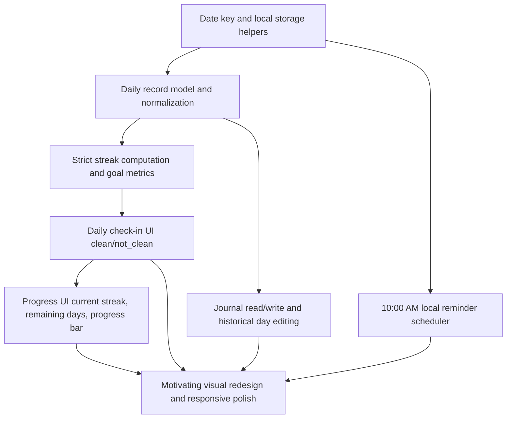

# Implementation Plan: Anti-Bad-Habit Tracker MVP

## Overview

This plan replaces the current multi-habit completion tracker with a single-habit interruption tracker focused on one daily decision (`clean` or `not_clean`). The implementation preserves a vanilla Vite setup and local-only persistence, introduces strict streak logic toward a 60-day goal, supports per-day journaling and historical edits, and adds an in-app reminder banner at 10:00 AM local time while the app is open.

## Constraints and Existing Patterns

- Keep technology scope to Vite + HTML + CSS + JavaScript only.
- Persist state in browser storage with defensive parsing.
- Use local browser timezone for all day keys and streak boundaries.
- Maintain semantic status values (`clean`, `not_clean`) and explicit helper functions.
- Existing code already centralizes rendering in `src/main.js` and styles in `src/style.css`.
- No automated test framework is currently configured; verification is primarily manual.

## Dependency Graph

Implementation order is bottom-up from foundations (`A`, `B`, `C`) to full user-facing slices (`D` through `H`).

## Risks and Unknowns

- Data migration from the old multi-habit shape to the new single-habit shape may fail if stored payloads are malformed.
- Day-boundary behavior for missed days must remain deterministic and align with the agreement that missed days default to `not_clean`.
- 10:00 AM reminder behavior must not imply reliability when the app is closed.

## Task 1: Establish state model and strict streak engine

**Description:** Create a normalized single-user state model for daily records and implement strict streak calculation toward 60 days. This includes storage load/save guards, date helpers, and deterministic handling of missed days as `not_clean` for streak purposes.

**Acceptance criteria:**

- [ ] App state uses one day record per date with shape `{ date, status, journal }`.
- [ ] Streak logic increments only through consecutive `clean` days and resets when a `not_clean` day appears.
- [ ] Missed days are treated as `not_clean` in streak progression logic.

**Verification:**

- [ ] Tests pass: `pnpm run test`
- [ ] Build succeeds: `pnpm run build`
- [ ] Manual check: seed sample records in storage and verify computed streak/remaining-days outputs for clean, missed, and not-clean sequences.

**Dependencies:** None

**Files likely touched:**

- `src/main.js`

**Estimated scope:** Small: 1-2 files

## Task 2: Deliver daily check-in flow end-to-end

**Description:** Replace current multi-habit list interactions with a single daily decision UI that allows setting today (or selected historical day) to `clean` or `not_clean`, persists the choice, and re-renders derived metrics.

**Acceptance criteria:**

- [ ] User can set a day status to `clean` or `not_clean` using explicit actions.
- [ ] Updating status immediately persists and updates current streak values.
- [ ] Historical day status can be edited after initial set.

**Verification:**

- [ ] Tests pass: `pnpm run test`
- [ ] Build succeeds: `pnpm run build`
- [ ] Manual check: set 3 consecutive days `clean`, then set next day `not_clean`; confirm strict reset behavior.

**Dependencies:** 1

**Files likely touched:**

- `index.html`
- `src/main.js`
- `src/style.css`

**Estimated scope:** Medium: 3-5 files

## Checkpoint: After Tasks 1–2

- [ ] All tests pass
- [ ] Application builds without errors
- [ ] Daily check-in and strict streak reset operate correctly for current and historical days

## Task 3: Implement 60-day goal visualization

**Description:** Add always-visible progress elements tied to streak engine outputs: current streak, remaining days to 60, and a bounded progress indicator/bar. Ensure values stay in sync with every status change.

**Acceptance criteria:**

- [ ] UI shows current streak and remaining days to goal at all times.
- [ ] Progress bar reflects `currentStreak / 60` and clamps between 0% and 100%.
- [ ] Progress metrics update instantly after any status edit.

**Verification:**

- [ ] Tests pass: `pnpm run test`
- [ ] Build succeeds: `pnpm run build`
- [ ] Manual check: change day statuses and verify numeric values and bar width match expected progression.

**Dependencies:** 1, 2

**Files likely touched:**

- `src/main.js`
- `src/style.css`

**Estimated scope:** Small: 1-2 files

## Task 4: Add per-day journal with persistence

**Description:** Implement optional journal notes for each day record, including create/edit workflows for today and historical days. Journal content must persist in local storage and survive reloads.

**Acceptance criteria:**

- [ ] User can add or edit journal text for any selected day.
- [ ] Journal data persists per date after reload.
- [ ] Journal is optional and does not block status updates.

**Verification:**

- [ ] Tests pass: `pnpm run test`
- [ ] Build succeeds: `pnpm run build`
- [ ] Manual check: enter journal for a day, reload, and confirm content remains associated with that date.

**Dependencies:** 1, 2

**Files likely touched:**

- `index.html`
- `src/main.js`
- `src/style.css`

**Estimated scope:** Medium: 3-5 files

## Checkpoint: After Tasks 3–4

- [ ] All tests pass
- [ ] Application builds without errors
- [ ] 60-day progress and per-day journal both persist and remain consistent after reload

## Task 5: Implement 10:00 AM in-app reminder banner

**Description:** Add a local-time reminder scheduler that shows a non-blocking in-app banner at 10:00 AM only while the app is open. Include clear copy that the reminder is in-app only.

**Acceptance criteria:**

- [ ] Reminder banner appears at 10:00 AM local time while app is open.
- [ ] Reminder can be dismissed and does not block check-in/journal actions.
- [ ] UI copy does not imply notifications when browser is closed.

**Verification:**

- [ ] Tests pass: `pnpm run test`
- [ ] Build succeeds: `pnpm run build`
- [ ] Manual check: use a controlled time test hook or system time change to verify banner appears at 10:00 AM.

**Dependencies:** 1, 2

**Files likely touched:**

- `src/main.js`
- `src/style.css`

**Estimated scope:** Small: 1-2 files

## Task 6: Apply motivating visual redesign and responsive polish

**Description:** Replace the current Material-style purple theme with an intentional motivating palette using CSS custom properties, purposeful motion, and responsive layout behavior for desktop and mobile without changing technical scope.

**Acceptance criteria:**

- [ ] `src/style.css` defines palette and UI tokens with CSS custom properties.
- [ ] Final layout is readable and usable on desktop and mobile widths.
- [ ] Animations are minimal, purposeful, and non-blocking.

**Verification:**

- [ ] Tests pass: `pnpm run test`
- [ ] Build succeeds: `pnpm run build`
- [ ] Manual check: verify contrast, spacing, and interaction usability at narrow and wide viewport sizes.

**Dependencies:** 2, 3, 4, 5

**Files likely touched:**

- `index.html`
- `src/style.css`
- `src/main.js`

**Estimated scope:** Medium: 3-5 files

## Checkpoint: After Tasks 5–6

- [ ] All tests pass
- [ ] Application builds without errors
- [ ] Reminder + redesigned UI work together across desktop/mobile without regressions

## Execution Notes

- Keep each task as a vertical slice that leaves the app in a working state.
- If needed, add a lightweight `test` script placeholder to satisfy standardized verification commands, but keep MVP verification manual-first.
- Document strict streak semantics in visible UI copy to prevent ambiguity about reset behavior.
